<div align="center">

# 🌸 ImageCraft — Text-to-Image Synthesis with GANs

**Type a description of a flower and get a picture of it.**
A text-conditioned DCGAN trained on the Oxford-102 Flowers dataset, using GloVe embeddings to encode the prompt.


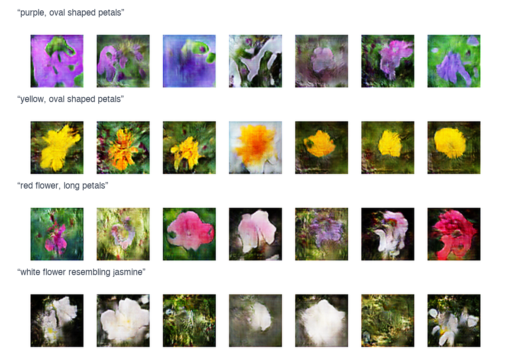

<sub>64×64 images generated by the model after 400–500 epochs. Each row is one prompt with different random noise.</sub>

[Results](#-results) · [How it works](#-how-it-works) · [Run it](#-getting-started) · [Paper & report](#-documents) · [Team](#-team)

</div>

---

## 📌 Overview

Text-to-image synthesis turns a written description (*"this flower is yellow in color with oval shaped petals"*) into an image that matches it. This project builds a **conditional Generative Adversarial Network** in TensorFlow/Keras:

- the **generator** receives random noise **and** an embedding of the text, and learns to draw a 64×64 flower,
- the **discriminator** receives an image **and** the text, and learns to tell real matching pairs from fakes *and* from real images paired with the wrong caption.

Our main experiment compares the same architecture under two **GloVe vocabulary sizes** (120K vs 1.29M words). The larger vocabulary gave visibly sharper and more faithful flowers for the same prompt (see [comparison](#-glove-vocabulary-120k-vs-129m)).

This was our final-year Capstone project (2022–23) at **BMS College of Engineering, Bengaluru**, Department of Information Science and Engineering. It was written up as an IEEE-format paper.

| | |
|---|---|
| **Dataset** | Oxford-102 Flowers: 102 categories, 8,189 images, 10 captions per image ([text_c10](https://github.com/reedscot/icml2016)) |
| **Training set** | 8,100 RGB images resized to 64×64, normalized to [-1, 1] |
| **Text encoding** | Pre-trained 300-d GloVe vectors, averaged over the characters of the caption |
| **Model** | Conditional DCGAN: generator 5.05M params, discriminator 2.90M params |
| **Training** | 500+ epochs, batch 64, Adam (lr 2e-4, β₁ 0.5), ~26 s/epoch on GPU |
| **Platform** | Amazon SageMaker Studio Lab (GPU), with Google Colab for development |

---

## 🖼 Results

### Best outputs (400–500 epochs)

<table>
  <tr>
    <td align="center">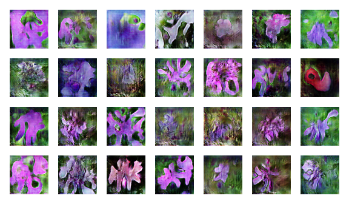<br><em>"This flower is purple in color with oval shaped petals"</em></td>
    <td align="center">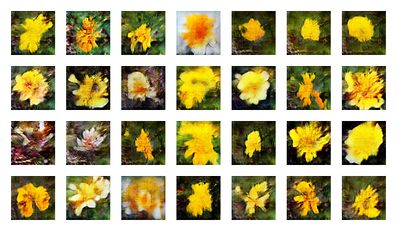<br><em>"The flower is yellow in color with oval shaped petals"</em></td>
  </tr>
  <tr>
    <td align="center">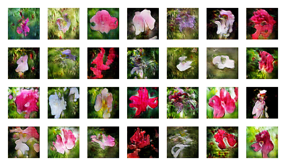<br><em>"A red flower with long petals"</em></td>
    <td align="center">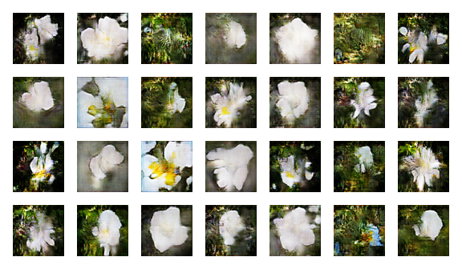<br><em>"This is a white flower resembling jasmine"</em></td>
  </tr>
</table>

### 🔬 GloVe vocabulary: 120K vs 1.29M

Same architecture, same prompt: *"This is a yellow color flower with oval shaped petals"*.

<table>
  <tr>
    <th>120K-word GloVe</th>
    <th>1.29M-word GloVe</th>
  </tr>
  <tr>
    <td>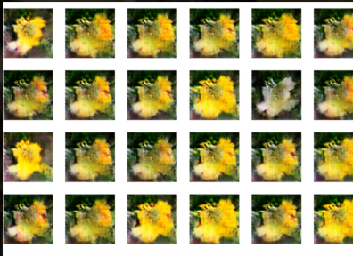</td>
    <td>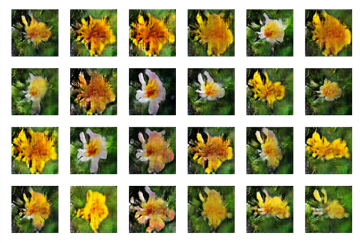</td>
  </tr>
  <tr>
    <td>Blurry, and most samples collapse to the same blob</td>
    <td>Distinct petals and centres, varied shapes, clean yellow</td>
  </tr>
</table>

> **Finding:** with a larger embedding vocabulary, the model produced sharper and more varied images for the same prompt. The 120K model shows clear mode collapse.

### 📈 Training progression

The same fixed noise and captions, rendered at three points during training:

| Early | Middle | Late |
|:---:|:---:|:---:|
| 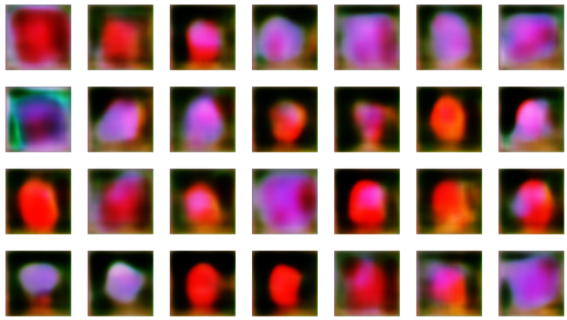 | 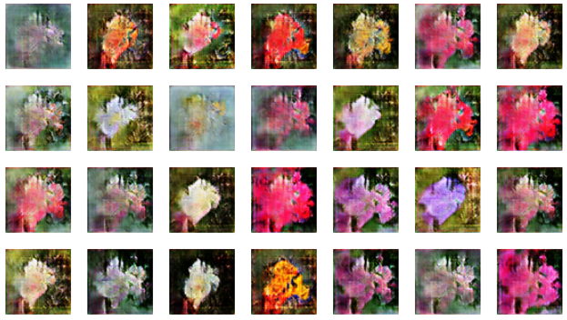 | 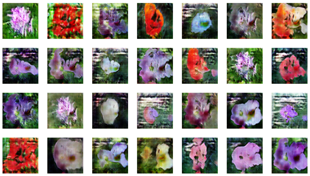 |
| Colour blobs, no structure | Petal shapes, green backgrounds | Recognisable flowers with texture |

<p align="center">
  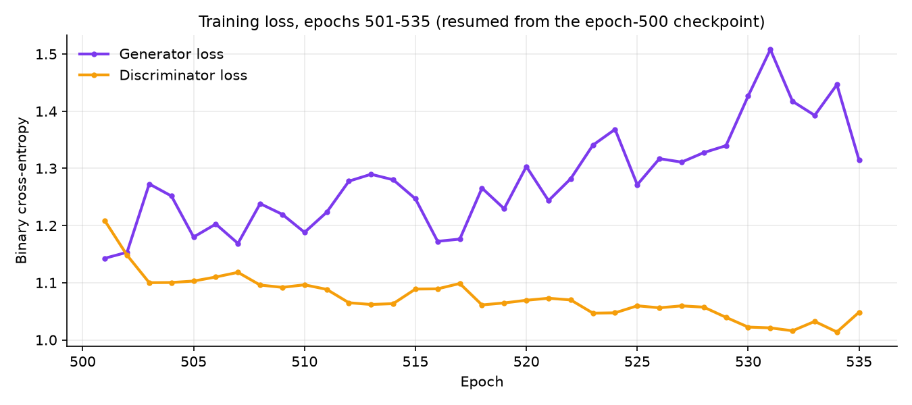<br>
  <sub>Per-epoch average losses logged in the notebook when training resumed from the epoch-500 checkpoint (epochs 501–535).</sub>
</p>

### 🎥 Live demo

<p align="center">
  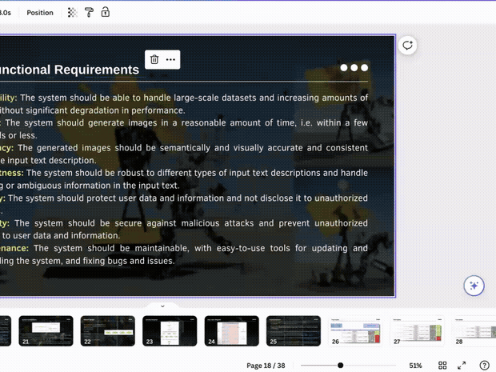<br>
  <sub>Prompts run live in SageMaker Studio Lab (4× speed). The full review presentation and demo are in <a href="docs/Review3_Presentation_and_Demo.mp4"><code>docs/Review3_Presentation_and_Demo.mp4</code></a>.</sub>
</p>

<details>
<summary><b>More prompt outputs from the notebook, including failure cases</b></summary>
<br>

| Prompt | Output |
|---|---|
| *this flower is purple in color with oval shaped petals* | 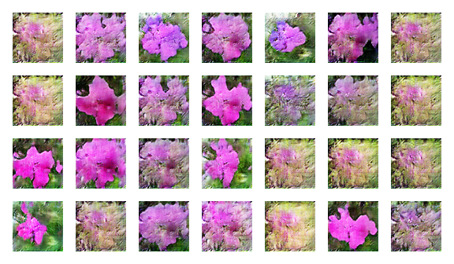 |
| *this flower is yellow in color with oval shaped petals* | 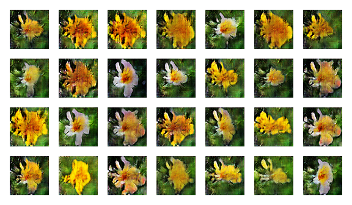 |
| *this flower is red in color with circle shaped petals* | 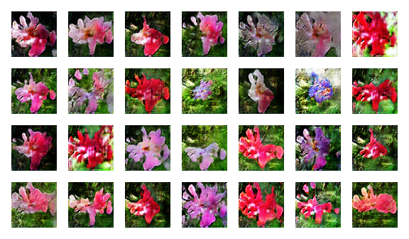 |
| *prominent purple stigma, petals are white in color* | 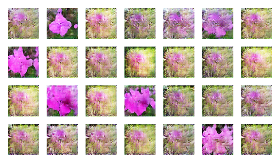 |
| *this flower is blue in color* ⚠️ comes out yellow/white | 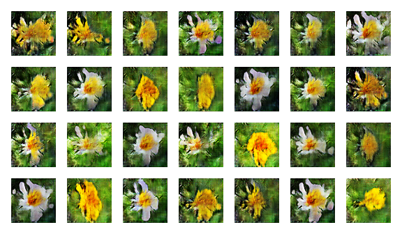 |
| *this flower is pink in color with oval shaped petals* ⚠️ mode collapse | 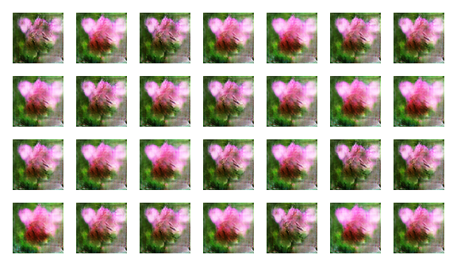 |
| *prominent purple stigma, petals are black in color* ⚠️ mode collapse | 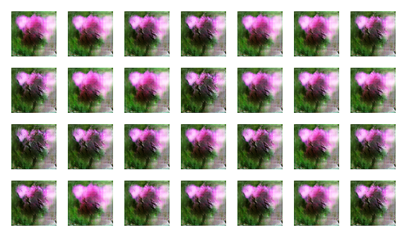 |

</details>

### ✅ Testing

We ran 10 prompt-engineering test cases against the trained model ([full sheet](docs/Test_Cases.pdf)). **7 of 10 passed.**

| ID | Scenario | Prompt | Result |
|---|---|---|:---:|
| TC1 | Single object | A red rose | ✅ |
| TC2 | Multi-object | A red rose, a yellow daffodil and green leaves | ❌ colours blended into one flower |
| TC3 | Adversarial | A garden with flowers, trees and a bench | ❌ can't render a bench |
| TC4 | Single object | A large, colorful flower | ✅ |
| TC5 | Multi-object | An orange, marigold-like flower | ✅ |
| TC6 | Variation & diversity | Purple petals with thin purple filaments | ✅ |
| TC7 | Single object (long) | Protuberant green stamen, circular purple fringe, wide tapered purple petals | ❌ captures only the main colours |
| TC8 | Ambiguous | Blue circular petals with white filaments | ✅ |
| TC9 | Rare object | Wide flower with green circular petals and black filaments | ✅ |
| TC10 | Rare object | A white jasmine with oval petals | ✅ |

**What it's good at:** single flowers described by colour and petal shape.
**Limits:** scenes with several objects, anything outside the flower domain, and long captions with fine detail. That is expected for a single-stage 64×64 GAN trained on flowers only.

---

## 🧠 How it works

<p align="center">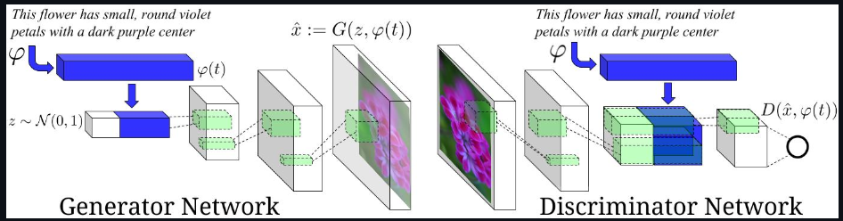</p>

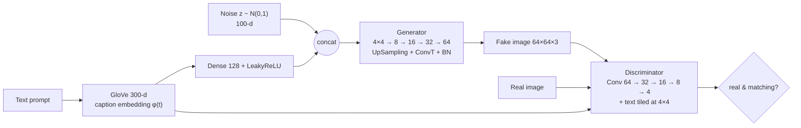

**1. Text encoding.** The caption is lower-cased and its spaces are removed. Each character is looked up in pre-trained 300-d GloVe and the vectors are averaged into one 300-d embedding.

**2. Generator** (`G(z, φ(t))`). The embedding is compressed to 128-d, concatenated with 100-d noise, projected to a 4×4×256 tensor and upsampled four times (UpSampling → Conv2DTranspose → BatchNorm → LeakyReLU) to a 64×64×3 `tanh` image.

**3. Discriminator** (`D(x, φ(t))`). Four stride-2 conv blocks bring the image down to 4×4×256. The text embedding is projected to 128 values, reshaped to 4×4×8 and concatenated, and a final conv + dense layer outputs a sigmoid score.

**4. Matching-aware loss** (after Reed et al., 2016). The discriminator is trained on three kinds of pairs:

| Pair | Target |
|---|---|
| real image + matching caption | real (label ~ U(0.8, 1.0)) |
| generated image + caption | fake (label ~ U(0.0, 0.2)) |
| real image + **shuffled** caption | fake (label ~ U(0.0, 0.2)) |

The last row forces the discriminator to check that the image matches the text as well as looking real. The noisy soft labels help keep training stable.

<details>
<summary><b>System design diagrams from the report</b></summary>
<br>

| GAN training flow | Module design |
|:---:|:---:|
| 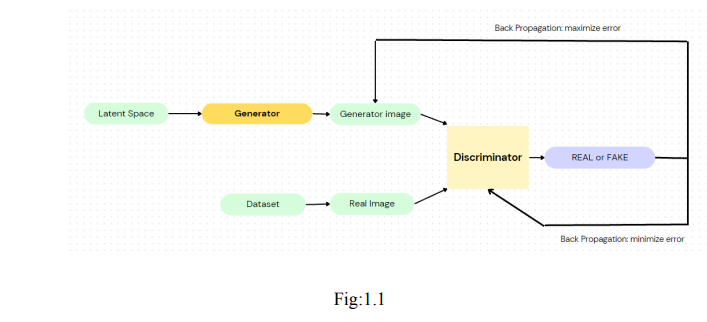 | 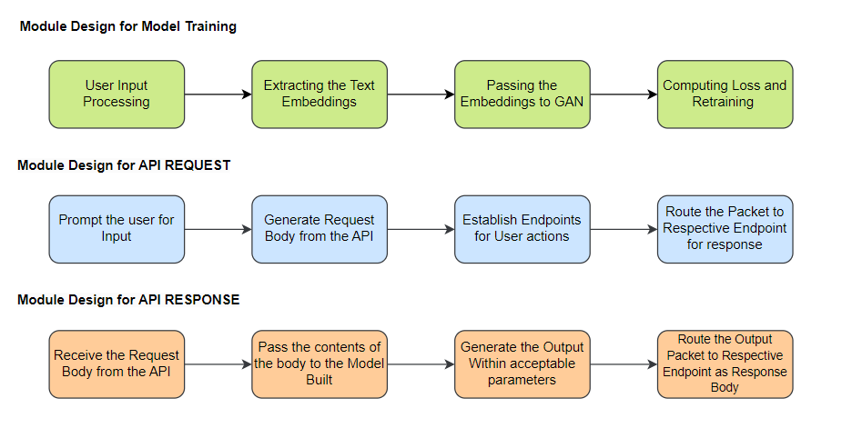 |
| **Activity diagram** | **Use-case diagram** |
| 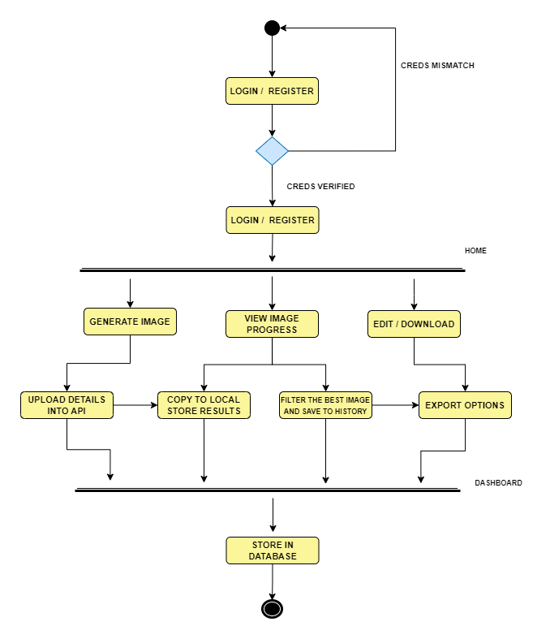 | 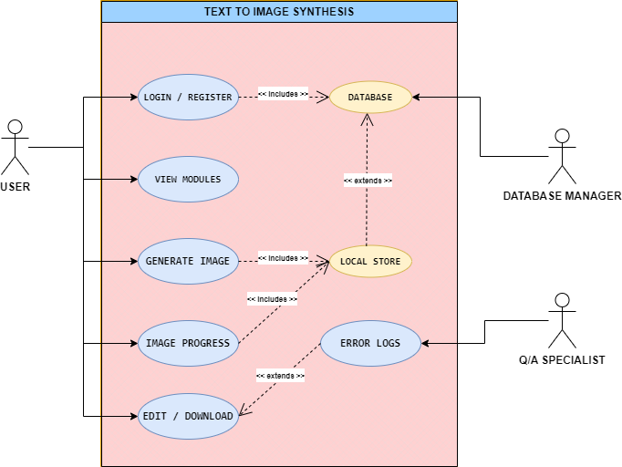 |

</details>

---

## 📂 Repository structure

```
textToImage_Capstone/
├── notebooks/
│   └── text_to_image_gan.ipynb   # original end-to-end notebook, outputs kept
├── src/                          # the same pipeline as Python modules
│   ├── config.py                 # paths + hyperparameters
│   ├── embeddings.py             # GloVe loader, caption → 300-d vector
│   ├── preprocess.py             # images → .npy chunks, captions → embeddings
│   ├── models.py                 # generator & discriminator
│   ├── train.py                  # matching-aware GAN training loop
│   └── generate.py               # prompt → 4×7 image grid
├── assets/                       # figures used in this README
├── docs/
│   ├── ImageCraft_IEEE_Paper.pdf
│   ├── Capstone_Report_Final.pdf
│   ├── Capstone_Report_Phase1.pdf
│   ├── Poster.pdf
│   ├── Test_Cases.pdf
│   └── Review3_Presentation_and_Demo.mp4
└── requirements.txt
```

---

## 🚀 Getting started

**1. Install**

```bash
git clone https://github.com/daivikrao/textToImage_Capstone.git
cd textToImage_Capstone
pip install -r requirements.txt
```

**2. Get the data** (not included in the repo because of size)

- Oxford-102 flower images → `flowers/images/jpg/`
- Captions (`text_c10`, from [Reed et al.](https://github.com/reedscot/icml2016)) → `flowers/text_c10/captions/`
- GloVe 300-d vectors from [Stanford NLP](https://nlp.stanford.edu/projects/glove/), e.g. `glove.6B.300d.txt`

Paths can be overridden with `FLOWERS_ROOT` and `GLOVE_PATH`.

**3. Preprocess, train, generate**

```bash
python src/preprocess.py                       # one-time: ~8K images → .npy, captions → embeddings
python src/train.py --epochs 500               # saves weights + a preview grid every epoch
python src/train.py --epochs 600 --resume 500  # continue from a checkpoint

python src/generate.py "this flower is yellow in color with oval shaped petals" \
    --weights flowers/model/generator_epoch_500.weights.h5
```

Or open [`notebooks/text_to_image_gan.ipynb`](notebooks/text_to_image_gan.ipynb) in Colab or SageMaker Studio Lab and run it top to bottom.

---

## 📄 Documents

| Document | Description |
|---|---|
| [IEEE paper](docs/ImageCraft_IEEE_Paper.pdf) | *ImageCraft – Text To Image Synthesis*: survey, system model, results |
| [Final report](docs/Capstone_Report_Final.pdf) | Full Capstone report: survey, SRS, design, implementation, testing, results |
| [Phase-1 report](docs/Capstone_Report_Phase1.pdf) | Literature survey and proposed system |
| [Poster](docs/Poster.pdf) | Project poster |
| [Test cases](docs/Test_Cases.pdf) | Prompt-variation test suite |
| [Demo video](docs/Review3_Presentation_and_Demo.mp4) | Review-3 presentation + live SageMaker demo (4 min) |

---

## 🔭 Future work

- Replace averaged GloVe vectors with contextual sentence encoders (BERT / CLIP text encoder), as proposed in the paper
- Stack a second stage (StackGAN / AttnGAN style) to reach 128–256 px
- Report quantitative metrics (Inception Score, FID) alongside visual comparison
- Serve the generator behind a simple web UI (the API flow in the module design diagram)

---

## 👥 Team

| | |
|---|---|
| **Aniket Gupta** | Department of ISE, BMSCE |
| **Daivik Rao** | Department of ISE, BMSCE |
| **P Yatish Sriram** | Department of ISE, BMSCE |
| **Guide: Dr. M Dakshayani** | Professor, Department of ISE, BMSCE |

## 🙏 References

- S. Reed et al., [*Generative Adversarial Text to Image Synthesis*](https://arxiv.org/abs/1605.05396), ICML 2016: base method
- J. Heaton, [*T81-558: Keras GAN*](https://github.com/jeffheaton/t81_558_deep_learning/blob/master/t81_558_class_07_2_Keras_gan.ipynb): DCGAN code reference
- H. Zhang et al., [*StackGAN*](https://arxiv.org/abs/1612.03242), ICCV 2017 · T. Xu et al., [*AttnGAN*](https://arxiv.org/abs/1711.10485), CVPR 2018
- J. Pennington et al., [*GloVe: Global Vectors for Word Representation*](https://nlp.stanford.edu/projects/glove/), EMNLP 2014
- M.-E. Nilsback & A. Zisserman, [*Oxford 102 Flowers*](https://www.robots.ox.ac.uk/~vgg/data/flowers/102/)
